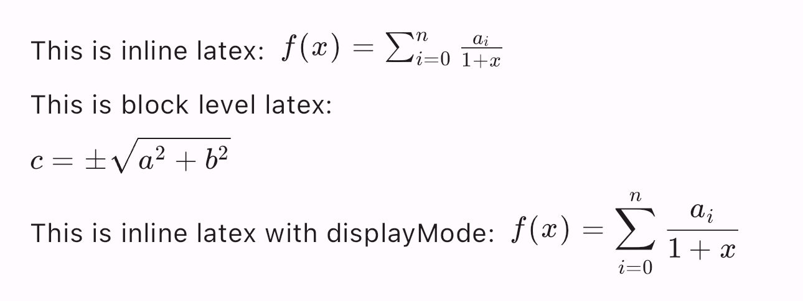

# Flutter Markdown Latex

This extension is created to enhance the functionality of the [flutter_markdown](https://pub.dev/packages/flutter_markdown) package by adding support for rendering LaTeX in markdown. The rendering of LaTeX is achieved through the utilization of the [flutter_math_fork](https://pub.dev/packages/flutter_math_fork) package.

## Rendering Samples

```text
This is inline latex: \$f(x) = \\sum_{i=0}^{n} \\frac{a_i}{1+x}\$

This is block level latex:

\$
c = \\pm\\sqrt{a^2 + b^2}
\$

This is inline latex with displayMode: \$\$f(x) = \\sum_{i=0}^{n} \\frac{a_i}{1+x}\$\$
```



## Getting Started

### Add dependency

Add `flutter_markdown_latex` to your `pubspec.yaml` dependencies.

### Import it

```dart
import 'package:flutter_markdown_latex/flutter_markdown_latex.dart';
```

### Render it

```dart
MarkdownBody(
  selectable: true,
  data: 'latex: \$c = \\pm\\sqrt{a^2 + b^2}\$',
  builders: {
    'latex': LatexElementBuilder(),
  },
  extensionSet: md.ExtensionSet(
    [LatexBlockSyntax()],
    [LatexInlineSyntax()],
  ),
),
```
